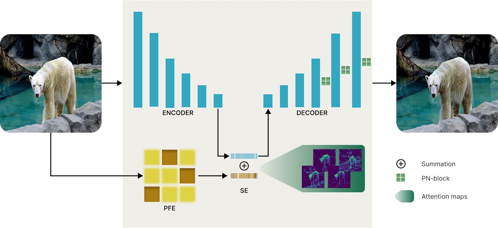

# PHNet: Patch-based Normalization for Image Harmonization

We present a patch-based harmonization network consisting of novel Patch-based normalization (PN) blocks and a feature extractor based on statistical color transfer. We evaluate our approach on available image harmonization datasets. Extensive experiments demonstrate the network's high generalization capability for different domains. Additionally, we collected a new dataset focused on portrait harmonization. Our network achieves state-of-the-art results on iHarmony4 and gains the best metrics on the synthetic portrait dataset.



For more information see our paper [PHNet: Patch-based Normalization for Image Harmonization](https://arxiv.org).

## Installation
Clone and install required python packages:
```bash
git clone <repo>
cd <repo>
# Create virtual env by conda or venv
conda create -n venv python=3.9 -y
conda activate venv
# Install requirements
pip install -r requirements.txt
```

## Dataset
We present Flickr-Faces-HQ-Harmonization (FFHQH), a new dataset for portrait harmonization based on the [FFHQ](https://github.com/NVlabs/ffhq-dataset). It contains real images, foreground masks, and synthesized composites. 

- Download link: [FFHQH]()


## Models
Also, we provide some pre-trained models called PHNet for demo usage.

- Download link: [PHNet]()

## Train
You can use downloaded trained models, otherwise select the baseline and parameters for training`.
To train the model, execute the following command:

```bash
python train.py ...
```

## Test
Test your model by running the following command:
```bash
python test.py ...
```

## Authors and Credits
- [Karen Efremyan](https://www.linkedin.com/in/befozg/)
- [Elizaveta Petrova](https://www.linkedin.com/in/kleinsbotle/)
- [Alexander Kapitanov](https://www.linkedin.com/in/hukenovs)

## Links
- [Github](https://github.com/befozg/PHNet/)
- [Mirror](https://gitlab.aicloud.sbercloud.ru/rndcv/PHNet)
- [arXiv]()
- [Kaggle FFHQH]()
- [Habr]()
- [Medium]()
- [Paperswithcode]()

## Citation
You can cite the paper using the following BibTeX entry:

    @article{phnet,
        title={PHNet: Patch-based Normalization for Image Harmonization},
        author={Efremyan, Karen and Petrova, Elizaveta and Kapitanov, Alexander},
        journal={arXiv preprint arXiv:},
        year={2022}
    }


### License
<a rel="license" href="http://creativecommons.org/licenses/by-sa/4.0/"></a><br />This work is licensed under a variant of <a rel="license" href="http://creativecommons.org/licenses/by-sa/4.0/">Creative Commons Attribution-ShareAlike 4.0 International License</a>.

Please see the specific [license](https://github.com/befozg/PHNet/blob/master/license/en_us.pdf).
